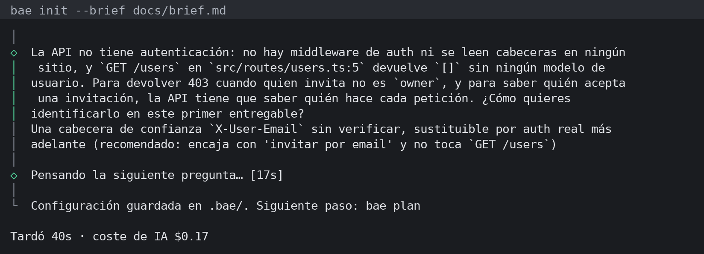
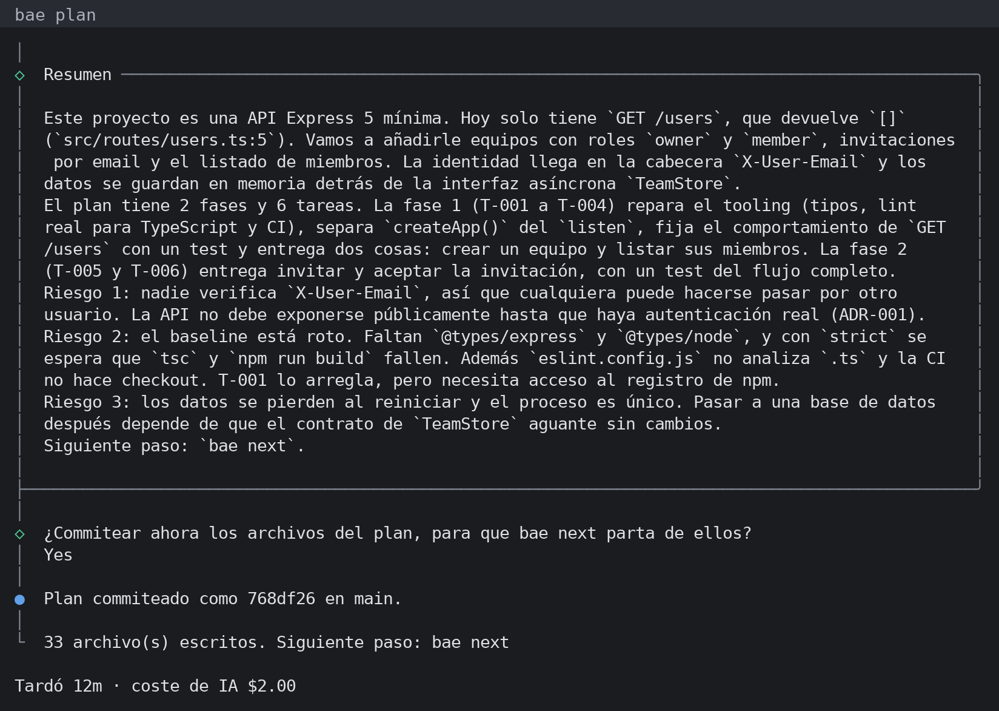

## 1. Qué es bae y qué no es

**Qué es.** bae (paquete npm `builder-assistant-engineer`) es una CLI que hace de jefe técnico para tu agente de consola. Te entrevista, analiza el repositorio y escribe un plan por fases en el que cada tarea es un prompt autocontenido. Después entrega las tareas a tu agente una a una y solo marca una tarea como hecha cuando pasan sus comprobaciones; cada tarea hecha queda en su propio commit.

**El problema que resuelve.** Pedirle a un agente "haz la funcionalidad" produce un cambio grande, sin plan, que el agente declara terminado sin pruebas y que no sabes si rompió algo. Entre sesiones el agente olvida lo decidido. bae parte el trabajo en tareas pequeñas con criterios de aceptación y un bloque de verificación ejecutable, guarda la memoria del proyecto en `AGENTS.md` y no se fía de lo que el agente dice: ejecuta los tests, el lint y una revisión antes de aceptar.

**Para quién.** Para quien ya trabaja con Claude Code u opencode y quiere delegar trabajo de varias tareas (una funcionalidad, una migración, reparar la base de tests y lint de un repo) sin perder el control de lo que entra.

**Cuándo no usarlo.**

- Un cambio de una línea o un bug puntual: abre tu agente directamente; el plan cuesta más que el arreglo.
- No puedes enviar el código a un proveedor de IA: bae manda un resumen del repositorio al backend que elijas.
- No hay forma de comprobar el trabajo y no quieres crearla: la primera tarea de un repo sin tests ni lint será crearlos.
- Necesitas varios agentes en paralelo, varios repositorios a la vez o un panel web: bae trabaja una tarea cada vez, en un repositorio.

## 2. Instalación y requisitos

**Qué necesitas.**

- Node.js 20.12 o posterior, git y bash (en Windows, Git Bash, que viene con Git for Windows).
- Un agente de consola instalado y con sesión iniciada. Probados: **Claude Code** (`claude`) y **opencode** (`opencode`). Experimentales, solo probados con dobles de test: **codex**, **gemini** y **api** (clave de Anthropic o de un endpoint compatible con OpenAI). También hay un backend `manual` que copia el prompt al portapapeles para cualquier chat.

**Cómo se instala.** Sin instalar nada, dentro de tu proyecto:

```sh
npx builder-assistant-engineer init
```

O una instalación global, que da el alias corto `bae` que usa el resto de este manual:

```sh
npm install -g builder-assistant-engineer
bae --version        # 0.4.0
```

No ejecutes `npx bae`: es otro paquete de npm. Aunque uses `npx`, los mensajes dicen `bae plan` o `bae next`; léelos como `npx builder-assistant-engineer plan`.

**opencode.** Pon un modelo fuerte en `opencode.json`. Si no hay ninguno, o parece gratuito o pequeño, `init` y `plan` avisan antes de gastar tiempo en un plan pobre.

**Windows.** Ejecuta los comandos en Git Bash. La CLI, el resumen del repositorio, las compuertas y la suite de tests se verifican en CI en Linux, macOS y Windows; las sesiones de agente solo se han ejecutado de verdad en Linux y no están verificadas en Windows.

**Por qué importa.** bae no incluye un modelo: usa el agente que ya tienes, con su sesión y sus permisos. Si el agente no arranca o no tiene sesión, bae se detiene antes de ejecutar ninguna comprobación.


## 3. Primer uso en 60 segundos

Cuatro comandos, siempre en la raíz del repositorio y con todo commiteado:

```sh
bae init      # idioma, backend, agentes y entrevista     (~1 min)
bae plan      # AGENTS.md, docs/plan/ y una tarea por archivo (10–15 min, $1–2)
bae next      # abre tu agente con la primera tarea         (4–10 min por tarea)
bae status    # dónde estás
```

Tiempos y costes medidos en corridas reales con Claude Code y Opus 5.5; varían con el tamaño del repositorio, el modelo y cuánto pregunte el analista. Las capturas son de una corrida real de 0.4.0 sobre una API Express pequeña, con el brief de la sección 5.

**`bae init`** pregunta el idioma (esta primera pregunta sale en inglés, porque aún no sabe cuál quieres), el tipo de proyecto, qué IA hará el análisis y qué agentes trabajarán en el repo, y luego hace la entrevista; con `--brief` el brief ya va cargado.



**`bae plan`** lee el repositorio y muestra cada archivo del plan según llega. Al final enseña los cambios y pregunta "¿Escribir 33 archivo(s)?" <!-- msg: artifacts.confirm --> (escribir todo, revisar uno a uno o nada), guarda los comandos del proyecto en `.bae/config.json`, resume el plan con sus riesgos y ofrece commitearlo como `chore(bae): plan`. Acepta: `next` parte de un repositorio sin cambios pendientes.



**`bae next`** la primera vez muestra todos los comandos que va a ejecutar y pregunta si confías en ellos (sección 6), registra la línea base (lo que ya falla queda como preexistente y no bloquea), crea la rama `bae/<fecha>-<hora>` y abre Claude Code con la tarea como primer mensaje. Trabaja con el agente como siempre y **sal de la sesión** (`/exit`) cuando termine: entonces bae ejecuta las compuertas, marca la tarea `done` y la commitea.

 y pregunta; No es la respuesta por defecto.")

.")

**`bae status`** enseña la rama del run con sus commits, cada fase con sus tareas, qué espera a qué y las métricas locales: intentos, tareas hechas al primer intento, regresiones atrapadas, coste y tiempo por tarea.

 y un cambio de alcance: replan (11 min, $2.48) corrigió la verificación de T-002, la reabrió y añadió T-007.")

---

## 4. Cómo funciona por dentro

<div class="flow"><span><b>init</b>entrevista</span><span><b>plan</b>resumen + analista</span><span><b>docs/plan/</b>tareas = prompts</span><span><b>next</b>agente en rama bae/…</span><span><b>compuertas</b>tests, lint, revisión</span><span><b>commit</b>uno por tarea</span></div>

**Entrevista.** `init` hace seis preguntas base (más el objetivo, en un repo existente) que puedes saltar con Enter. Después el analista lee el repositorio y hace hasta cinco preguntas de seguimiento, con opciones y su motivo. Las respuestas quedan en `.bae/interview.md` (editable) y la configuración en `.bae/config.json`.

**Resumen del repositorio (digest).** Lo que el analista recibe: árbol de archivos, manifiestos, puntos de entrada, documentación, TODOs y qué hay de tests, lint, formateador, typecheck y CI. Respeta `.gitignore` y `.baeignore`, omite binarios, lockfiles, `node_modules`, `.env` y claves, redacta los secretos que encuentra y cabe en 100.000 caracteres (`digest.maxChars`).

**Plan.** El analista es tu agente en modo solo lectura: nunca escribe archivos. Devuelve el plan en un formato estricto y bae lo valida, comprueba que cada ruta citada existe (y cada `archivo:línea`), te enseña un diff y pregunta antes de escribir. Escribe `AGENTS.md` (memoria del proyecto que todo agente lee al abrir el repo; `CLAUDE.md` lo importa), `docs/plan/` (visión, PRD, arquitectura, ADRs, roadmap), una tarea por archivo en `docs/plan/tasks/`, subagentes en `.claude/agents/` y `.opencode/agent/` (incluido un revisor) y comandos `/next`, `/review` y `/status` que te remiten a bae.

**Tareas como prompts.** Cada `T-NNN-*.md` lleva en su frontmatter `status`, fase, dependencias, tamaño, riesgo, política de tests (`tests: required` exige más tests o aserciones) y tipo de commit; en el cuerpo, objetivo, contexto, alcance, pasos, criterios de aceptación, un bloque `## Verification` con comandos y un `## Log` para la nota de traspaso. El estado vive en el archivo y se versiona con el código. Cada tarea sirve como prompt suelto (`claude -p "$(cat docs/plan/tasks/T-003-*.md)"`), aunque fuera de bae no pasa por las compuertas.

**Rama y commits.** El primer `next` crea `bae/<fecha>-<hora>` desde tu rama actual (pregunta antes). Cada tarea hecha se commitea ahí como `<tipo>: <título> (T-NNN)` con el trailer `Bae-Task: T-NNN`, y solo con sus archivos. Tus hooks de git corren como siempre.

**Compuertas.** Antes de abrir el agente, bae registra una línea base (lint, typecheck, build y test del proyecto) y captura el estado: commit, archivos sin commitear, configuración, tarea y prompts. Al salir el agente, en este orden:

| Compuerta | Qué exige |
| --- | --- |
| Contrato | El agente no cambió lo que define sus propias comprobaciones: su tarea fuera de `## Log`, otras tareas, `.bae/`, scripts de `package.json`, configuración de tests y lint, `.gitignore`. Lo cambiado se restaura y el intento falla. |
| Regresión | Lo que pasaba antes sigue pasando, y no aparece ningún test que falle nuevo. |
| Integridad de tests | No se borran, saltan (`.skip`, `.only`, `xit`…) ni se quitan aserciones sin que el Alcance lo diga. |
| Verificación | El bloque `## Verification` corre como un script de bash con `set -Eeuo pipefail`. |
| Revisión mecánica | Sin secretos en el diff, con tests nuevos si `tests: required`, y aviso de archivos fuera del Alcance. |
| Revisión con IA | El revisor generado compara el diff con los criterios de aceptación y `AGENTS.md`, en solo lectura. |

Si todo pasa, la tarea queda `done` y se commitea; si no, queda `in_progress` con el motivo. Una nota de traspaso ausente o de más de 8 líneas bajo `## Log` es solo un aviso.

**Estado en git y fuera de él.** Lo que es del proyecto vive en git: plan, estado de cada tarea, `AGENTS.md`, configuración y la rama del run. Lo que las compuertas necesitan para no ser engañadas vive fuera del repositorio, en `~/.bae/<repo>/` (`BAE_HOME` lo mueve): capturas, línea base, logs, intentos, la rama registrada y los comandos que aprobaste. Así un agente que edita el repositorio no puede reescribir lo que lo comprueba.


## 5. Cómo sacarle provecho

### Escribe un buen brief

Un brief de diez líneas en un archivo rinde más que las respuestas sueltas de la entrevista. Di qué y para quién, qué entra y qué no en el primer entregable, **cómo sabrás que funciona** (en términos comprobables: códigos HTTP, comandos en verde), restricciones de stack y versiones, y qué no se toca. Pásalo con `bae init --brief docs/brief.md` (varios archivos separados por comas). El de las capturas:

```text
Qué y para quién: equipos para esta API Express; roles owner y member.
Dentro: crear equipo, invitar por email, aceptar, listar miembros con rol.
Fuera: facturación, SSO, borrar equipos, interfaz web.
Cómo sabré que funciona: un test supertest por endpoint, incluidos 403 y 404;
  npm test y npm run lint en verde.
Restricciones: Express 5 y vitest; almacenamiento en memoria tras una interfaz.
No tocar: GET /users responde igual.
```

**Por qué importa.** El analista convierte "cómo sabré que funciona" en criterios de aceptación y bloques de verificación. Si no lo dices, lo inventa.

### Responde en serio las preguntas de seguimiento

Cada pregunta viene con el porqué y opciones, y señala una decisión que cambia qué tareas existen. En la corrida de las capturas, el analista vio que la API no identificaba a nadie y preguntó cómo saber quién invita para devolver 403: una cabecera `X-User-Email` sin verificar o autenticación real son planes distintos. Enter la salta y el analista asume. Si `plan` encuentra preguntas bloqueantes, las hace ahí mismo y ofrece planificar otra vez; las demás quedan en `.bae/interview.md`.

### Revisa el plan antes del primer `next`

Lee `docs/plan/00-overview.md` y `04-roadmap.md`, y en cada tarea el Alcance, los criterios y el bloque `## Verification`: es lo que decidirá si la tarea está hecha. Mira también `commands` en `.bae/config.json`. Todo es markdown y JSON: edítalo y commitea antes de empezar. `bae next --dry-run` muestra la tarea exacta que recibirá el agente sin ejecutar nada.

### Interactivo primero, headless después

Haz la primera tarea en interactivo (`bae next`): ves lo que hace el agente, apruebas los comandos del repositorio y compruebas que la línea base es fiable. Sal de la sesión del agente cuando termine; bae ejecuta entonces las compuertas. Después, `bae next --headless --yes` trabaja sin sesión: el agente acepta ediciones (nunca con bypass de permisos), con Claude Code solo puede ejecutar los comandos de la tarea e instalar dependencias, y tiene hasta tres intentos por tarea con el fallo anterior como contexto. Sin `--yes`, headless aún pregunta por la rama, la línea base y la verificación.

### Cuando una tarea queda `blocked` o `needs_review`

- `blocked`: agotó sus tres intentos o su verificación no puede ejecutarse. El mensaje da la causa y la ruta de los logs, y los cambios del agente quedan sin commit en tu árbol de trabajo: revísalos o descártalos. Corrige la causa (la tarea, un comando, una dependencia), pon `status: pending` en su archivo y vuelve a correr `bae next`.
- `needs_review`: el plan escribió un bloque `## Verification` que bae no acepta; `review_note` dice qué cambiar. Corrígelo y pon `status: pending`.
- Si el entorno falla (agente sin sesión, programa inexistente, un comando denegado al agente), bae se detiene sin gastar intento y dice qué arreglar.

### Replanifica cuando cambie el alcance

Edita `.bae/interview.md` (o responde ahí las preguntas abiertas) y ejecuta `bae replan` en la rama del run. Conserva las tareas hechas, actualiza o elimina las pendientes, no reutiliza ids, añade una entrada a `docs/plan/CHANGELOG.md` y commitea `chore(bae): replan` (si aún no hay run, no commitea: hazlo tú). No borres el plan para empezar de cero: perderías el historial de tareas.

### Aprovecha las lecciones de `AGENTS.md`

Cuando una tarea queda `blocked` o falla la revisión dos veces, el agente propone la causa raíz y una regla de una línea. Si la apruebas, entra en "Lecciones aprendidas" dentro del bloque gestionado de `AGENTS.md`, que leen todos los agentes y el revisor y que `replan` conserva. Aprueba solo reglas generales y comprobables; edítalas o bórralas entre tareas (durante una tarea `AGENTS.md` está protegido) y commitea. Con `--yes` se aprueban sin preguntar.

### Abre el PR desde la rama del run

Tras la última tarea, `next` imprime `gh pr create --base <tu rama> --head bae/<run>` sin ejecutarlo. Con un commit por tarea, revisa el PR commit a commit contra cada archivo de tarea. Después de mergear, `bae next --new-run` empieza otra rama desde donde estés.

## 6. Seguridad y privacidad

**Qué sale de tu máquina.** Solo lo que va al backend que elegiste, con las reglas de ese proveedor: en `init`, `plan` y `replan`, el prompt del analista con el resumen del repositorio y tu entrevista; en `review` y en las compuertas, el diff de la tarea; en `next`, lo que tu agente lea y envíe en su sesión, como siempre. Con Claude Code, el analista y el revisor corren con herramientas de solo lectura (`Read`, `Grep`, `Glob`) y sin tus servidores MCP, conectores ni skills.

**Qué no sale.** Nada va a los autores de bae: no hay telemetría. El resumen omite `.env`, claves, lockfiles, binarios, `node_modules` y lo ignorado en `.gitignore` y `.baeignore`, y redacta tokens y contraseñas. El estado de las compuertas se queda en `~/.bae`, legible solo por tu usuario.

> El resumen no incluye `.env`, pero el analista puede abrir un archivo del repositorio si lo busca. Si hay secretos en el repo, sácalos o niega su lectura en tu configuración de usuario de Claude Code, por ejemplo `"permissions": { "deny": ["Read(./.env)"] }` en `~/.claude/settings.json`.

**Aprobación de confianza.** La primera vez que `next` va a ejecutar algo en un repositorio en tu máquina, lista todos los comandos (los del proyecto, cada `## Verification` de las tareas abiertas y `verify.allow`) y lo que el agente cargará por su cuenta (hooks y plugins de `.claude/settings.json`, servidores MCP de `.mcp.json`, MCP y plugins de opencode), y pregunta "¿Confías en ellos?", con No por defecto. <!-- msg: trust.confirm --> `--yes` y `--headless` no responden esta pregunta: sin terminal, `next` se detiene. Tras un pull o un replan vuelve a preguntar, solo por lo nuevo o cambiado.

**Qué ejecuta bae.** git, los comandos `lint`, `typecheck`, `build` y `test` de `.bae/config.json` antes y después de cada tarea, y el bloque `## Verification` de la tarea. En interactivo te los muestra y confirmas. Cuando nadie confirma (`--headless` o `--yes`) solo corren runners y chequeos conocidos más lo que añadas a `verify.allow`; el código inline (`node -e`, `python -c`) y `curl` enviando datos a algo que no sea localhost se rechazan. Nunca lanza un agente con bypass de permisos. Los tests son código que el agente pudo escribir y corren con tus permisos: para trabajo no confiable, usa un contenedor.

**Revisa un plan ajeno antes de correrlo.** Si clonas un repositorio que ya trae `.bae/` y `docs/plan/`:

```sh
cat .bae/config.json                          # commands y verify.allow
grep -A12 '## Verification' docs/plan/tasks/*.md
cat .claude/settings.json .mcp.json 2>/dev/null   # hooks y MCP que cargará tu agente
bae next --dry-run                            # la tarea tal cual, sin ejecutar nada
```

Mira también los scripts de `package.json` (o el Makefile): `npm test` ejecuta lo que diga ahí. Si algo no cuadra, responde No en la pregunta de confianza; no se ejecuta nada. El analista y el revisor tratan el contenido del repositorio como datos y señalan el texto que se dirige a una IA.

## 7. Problemas frecuentes

Los ocho mensajes que más verás al empezar, con su texto real en 0.4.0 (abreviado con …).

| Mensaje | Qué significa | Qué hacer |
| --- | --- | --- |
| opencode no tiene "model" en opencode.json, así que usará el suyo por defecto, que puede ser gratuito. <!-- msg: opencode.noModel --> | Un modelo pequeño escribe planes pobres. Sale en `init` y `plan` con opencode. | Pon un `"model"` fuerte en `opencode.json`, o usa `--backend claude`. |
| `claude` no está instalado o no está en el PATH. Instálalo o elige otro backend con --backend. <!-- msg: backend.notInstalled --> | bae no encuentra la CLI del agente. No se ejecutó nada. | Instala el agente e inicia sesión, o cambia de backend. |
| Cambios sin commit fuera del plan … No se ejecutó nada. Haz commit o stash de estos cambios … (o añade --allow-dirty para empezar igualmente). <!-- msg: next.dirtyTitle, next.dirtyStop --> | Hay archivos versionados modificados que no son del plan; en interactivo pregunta si empezar igualmente. | Commit o stash. Con `--allow-dirty` esos archivos quedan fuera del commit de la tarea. |
| `npm test` no encontró un programa que ejecuta (exit 127), así que no hay baseline. Instala las dependencias del proyecto … <!-- msg: regression.notFound --> | Faltan dependencias o una herramienta; sin línea base la tarea no podría compararse. | `npm install` (o el equivalente) y vuelve a correr `bae next`. |
| `claude` terminó con código 1 antes de acabar la tarea (por ejemplo, se respondió No a la pregunta de confianza en la carpeta, la CLI no tiene sesión iniciada o falló) … <!-- msg: backend.sessionFailed, next.stopped --> | El agente salió con error; bae no ejecutó comprobaciones y no cuenta el intento. | Responde Sí a la confianza en la carpeta de Claude Code, inicia sesión y repite. |
| El agente no cambió ningún archivo para T-001, así que bae no ejecutó sus comprobaciones. <!-- msg: next.noChanges --> | Saliste de la sesión antes de que el agente trabajara. No cuenta como intento. | `bae next` retoma la misma tarea. |
| claude no tuvo permiso para ejecutar `npx tsx scripts/seed.ts`, así que otro intento fallaría igual. … <!-- msg: env.denied --> | En headless, Claude Code solo puede correr los comandos de la tarea e instalar dependencias. | Permite ese comando en Claude Code (p. ej. `Bash(npx tsx *)` en `.claude/settings.json` de una carpeta de confianza) o hazlo en interactivo. |
| T-001 queda bloqueada: El chequeo de regresión falló. Logs: … Para reintentar, corrige la causa, pon `status: pending` … <!-- msg: next.blocked --> | Tres intentos fallidos. Los cambios del agente siguen sin commit en tu árbol. | Lee los logs, corrige la tarea o el código, pon `status: pending` y `bae next`. |

Si estás en otra rama que la del run, `next` lo dice y te ofrece volver con `git switch` o empezar otra con `--new-run`. <!-- msg: run.elsewhere -->


---

## 8. Referencia de comandos y flags

| Comando | Qué hace | Flags |
| --- | --- | --- |
| `init` | Configura bae en el repo y hace la entrevista. | `--brief <archivos>` separados por comas |
| `plan` | Analiza el repo y escribe plan, memoria y agentes; ofrece commitearlos. `--only` escribe un solo grupo, pero el análisis es completo y cuesta lo mismo. | `--only plan\|agents\|memory` · `--no-verify` |
| `next` | Ejecuta la siguiente tarea lista, la comprueba y la commitea. | `--headless` · `--accept-finding <id>` (repetible) · `--allow-skip` · `--allow-dirty` · `--new-run` · `--no-verify` |
| `status` | Rama del run, commits, fases, tareas y métricas locales. | — |
| `replan` | Reanaliza con el trabajo hecho y actualiza lo pendiente. | `--no-verify` |
| `review [tarea]` | Revisión mecánica y con IA del diff de una tarea (por defecto, la en curso). Sale con 1 si falla. | `--accept-finding <id>` |

**Flags globales.** `--backend claude|opencode|codex|gemini|api|manual` · `--lang en|es` · `--dry-run` (muestra lo que se enviaría a la IA y no cambia nada) · `-y, --yes` (acepta toda confirmación, salvo la de confianza) · `-v, --version` · `-h, --help`.

| Flag de `next` | Úsalo cuando |
| --- | --- |
| `--headless` | El agente debe trabajar sin sesión, con hasta tres intentos. Combínalo con `--yes`. |
| `--accept-finding <id>` | Aceptas un hallazgo concreto, por el id que imprime la compuerta, p. ej. `secret-1a2b3c4d`. Queda registrado. |
| `--allow-skip` | Un chequeo no puede correr (sin git, sin línea base, sin veredicto del revisor) y decides seguir; se registra. |
| `--allow-dirty` | Quieres empezar aunque haya cambios sin commit fuera del plan. |
| `--new-run` | Empiezas una rama `bae/` nueva, por ejemplo tras mergear la anterior. |
| `--no-verify` | Tus hooks pre-commit o commit-msg impiden commitear la tarea. |

**Configuración** (`.bae/config.json`). `commands.test|lint|typecheck|build` · `gates.regression`: `full` (por defecto, línea base antes y después), `task` (solo después) u `off` (solo la verificación de la tarea) · `gates.timeoutMinutes` (15) · `agent.timeoutMinutes` (45, headless) · `verify.allow`: prefijos de comandos que pueden correr sin confirmación · `secrets.allow`: rutas que el chequeo de secretos omite · `digest.maxChars` (100000).

**Archivos.** `.bae/config.json` y `.bae/interview.md` (versionados) · `.bae/tmp/` (ignorado; `plan-report.json`, respuestas crudas) · `.bae/prompts/<nombre>.md` sustituye un prompt de `src/prompts` · `docs/plan/tasks/T-NNN-*.md` · `~/.bae/<repo>/` estado fuera del repo.

**Variables de entorno.** `BAE_HOME` (mueve `~/.bae`) · backend `api`: `ANTHROPIC_API_KEY`, u `OPENAI_BASE_URL` + `OPENAI_API_KEY`, con `BAE_MODEL`; `BAE_API_PROVIDER` si hay ambos.
