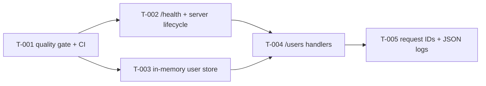

# Roadmap

Task status lives only in each task's frontmatter (`docs/plan/tasks/*.md`). Use `/status` to see it.

## Phase 1 — Baseline and health
- Tasks: T-001, T-002
- Demo: `go run .`, then `curl -i localhost:8080/health` returns `200` and `{"status":"ok"}`. `curl -i localhost:8080/nope` returns a JSON 404. Ctrl-C exits cleanly. `sh scripts/check.sh` passes. `.github/workflows/ci.yml` passes actionlint.

## Phase 2 — Users API (first deliverable)
- Tasks: T-003, T-004
- Demo:
  ```text
  curl -i -X POST localhost:8080/users -d '{"name":"Ada","email":"Ada@Example.com"}'   → 201 {"id":"1","name":"Ada","email":"ada@example.com"}
  curl -s localhost:8080/users                                                          → {"users":[{"id":"1",...}]}
  curl -i -X POST localhost:8080/users -d '{"name":"A2","email":"ada@example.com"}'    → 409 email_taken
  ```
  All handler and store tests pass, including concurrency tests (with `-race` in CI).

## Phase 3 — Operability
- Tasks: T-005
- Demo: every request prints one JSON log line with `request_id`. `curl -i -H 'X-Request-ID: abc-123' localhost:8080/health` echoes `abc-123`. A panic returns the JSON 500 envelope.

## Dependency graph

T-002 and T-003 can run in parallel; they touch different files. T-005 comes after T-004 because both edit `internal/handler/handler.go` and `main.go`.

## Task index
| ID | Title | Phase | Depends on | Size | Risk |
| --- | --- | --- | --- | --- | --- |
| T-001 | Add the quality gate script, staticcheck lint and GitHub Actions CI | 1 | — | S | low |
| T-002 | Serve GET /health from a Gin router with graceful shutdown | 1 | T-001 | M | medium |
| T-003 | Implement the concurrency-safe in-memory user store | 2 | T-001 | S | low |
| T-004 | Add POST /users and GET /users handlers backed by the store | 2 | T-002, T-003 | M | medium |
| T-005 | Add request IDs and structured JSON request logging with slog | 3 | T-004 | S | low |

## Deferred (not planned; each needs a new task and possibly an ADR)
- `GET /users/{id}`, and pagination or filtering on `GET /users` (Q2)
- Dockerfile or deployment manifests, and a separate readiness probe (Q5)
- Prometheus `/metrics` and OpenTelemetry tracing
- A limit on the number of users, and rate limiting
- Raising the `go` version in go.mod (Q4) and upgrading gin
- Persistence and authentication (out of scope by the brief)
