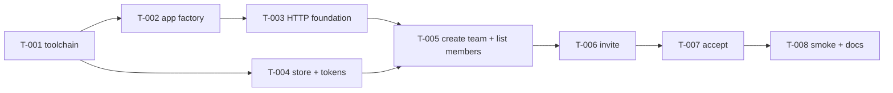

# Roadmap

## Phase 1: Baseline and safety net
Tasks: T-001, T-002.
**Demo:**
- From a fresh clone: `npm ci`, `npm run lint`, `npm run format:check`, `npm run typecheck`, `npm test` and `npm run build` all exit 0.
- `npm start`, then `curl -s localhost:3000/users`, prints `[]`.
- `PORT=4000 npm start` listens on 4000.
- The CI workflow runs the same gates on push and pull request.

## Phase 2: Teams MVP
Tasks: T-003 to T-008.
**Demo:**
- `npm run build && npm run smoke` prints `smoke ok` after running create team → invite → accept → list members over real HTTP against `dist/`.
- The README curl walkthrough works manually with the dev `ConsoleMailer` printing the token.
- `GET /users` still returns `[]`.

## Deferred (no tasks yet)
- `GET /teams` (my teams)
- Resend/revoke invites
- Remove member / leave team
- Role changes and ownership transfer
- Real authentication (Q1)
- Durable storage (Q2)
- Real email provider (Q3)
- Rate limiting on invites
- Structured request logging with token redaction
- `/users` pagination (src/routes/users.ts:4)
- CLI args and shebang (src/cli.ts:1-2)

## Dependency graph

T-004 can run in parallel with T-002/T-003 because it touches only `src/teams/*` and `test/teams/*`.

## Task index
Status lives only in each task's frontmatter.

| ID | Title | Phase | Depends on | Size | Risk | Owner agent |
| --- | --- | --- | --- | --- | --- | --- |
| T-001 | Establish a working toolchain baseline | 1 | — | M | medium | toolchain |
| T-002 | Extract createApp() and pin GET /users | 1 | T-001 | S | low | backend |
| T-003 | Add HTTP foundation: errors, validation, identity | 2 | T-002 | M | low | backend |
| T-004 | Add team domain types, in-memory store and invite tokens | 2 | T-001 | M | low | backend |
| T-005 | Implement create team and list members | 2 | T-003, T-004 | M | medium | backend |
| T-006 | Implement invite by email | 2 | T-005 | M | medium | backend |
| T-007 | Implement invite acceptance | 2 | T-006 | M | medium | backend |
| T-008 | Add built-app smoke test, CI step and docs | 2 | T-007 | S | low | test-engineer + docs-writer |
