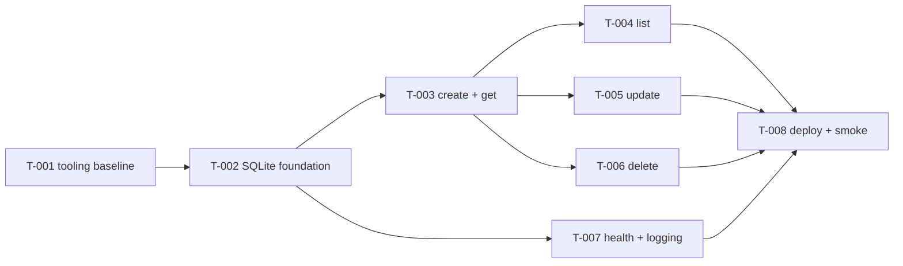

# Roadmap

## Phases and demo criteria

### Phase 1: baseline and first vertical slice (T-001, T-002, T-003)
- **Goal:** the project is installable and verifiable, and notes can be created and read back from SQLite.
- **Demo:**
  - The four Check commands in AGENTS.md pass locally, and the CI workflow file is present.
  - Start `NOTES_DB_PATH=/tmp/notes-demo.db .venv/bin/python -m uvicorn app.main:app`.
  - `curl -X POST localhost:8000/notes -H 'content-type: application/json' -d '{"title":"First","tags":["Work"]}'` returns 201 with `tags: ["work"]`.
  - `curl localhost:8000/notes/1` returns the same note. After a server restart, it still does.

### Phase 2: complete CRUD, the first deliverable (T-004, T-005, T-006)
- **Goal:** list (pagination and tag filter), update (PATCH) and delete, all with validation and tests.
- **Demo:**
  - `curl 'localhost:8000/notes?tag=work&limit=2'` returns a filtered page with `total`.
  - PATCH changes the title and replaces tags.
  - DELETE returns 204, then GET returns 404.
  - `pytest --cov=app --cov-fail-under=90` passes.

### Phase 3: operable on Linux servers (T-007, T-008)
- **Goal:** health reflects DB state, logs are useful, deployment is documented and repeatable, and there is a live end-to-end check.
- **Demo:**
  - `.venv/bin/python scripts/smoke.py` prints `smoke OK`. It runs the full CRUD cycle, restarts the server, and checks the data persisted.
  - `/health` returns 503 when the DB is unusable.
  - `docs/operations.md` explains install, systemd, backup and upgrade.

## Dependency graph

The graph is acyclic. T-004, T-005, T-006 and T-007 don't depend on each other. However, T-004 to T-006 all edit `app/schemas.py`, `app/repository.py`, `app/notes.py` and `README.md`, so run them one after another unless you accept merge work on separate branches.

## Task index
Status is tracked only in each task file.

| ID | Title | Phase | Size | Risk | Depends on | Suggested agent |
| --- | --- | --- | --- | --- | --- | --- |
| T-001 | Establish tooling baseline: formatter, type checking, real tests and CI | 1 | M | low | none | platform |
| T-002 | Add SQLite persistence layer, settings and app factory with startup migrations | 1 | M | medium | T-001 | backend |
| T-003 | Implement POST /notes and GET /notes/{note_id} with validation and tag normalization | 1 | M | medium | T-002 | backend |
| T-004 | Implement GET /notes with pagination, stable ordering and tag filtering | 2 | M | medium | T-003 | backend |
| T-005 | Implement PATCH /notes/{note_id} for partial updates including tag replacement | 2 | M | low | T-003 | backend |
| T-006 | Implement DELETE /notes/{note_id} with cascading tag removal | 2 | S | low | T-003 | backend |
| T-007 | Make /health check the database and configure application logging | 3 | S | low | T-002 | backend |
| T-008 | Add Linux deployment artifacts, operations guide and live smoke test | 3 | M | medium | T-004, T-005, T-006, T-007 | platform |

## Deferred (not planned)
- `GET /tags` with counts; full-text search; custom sort orders.
- ETag/If-Match conflict detection; soft delete; bulk operations.
- Lockfile (pip-tools or uv); Docker image; Postgres; rate limiting; metrics endpoint.
- Authentication and a web UI are out of scope entirely (from the brief).
